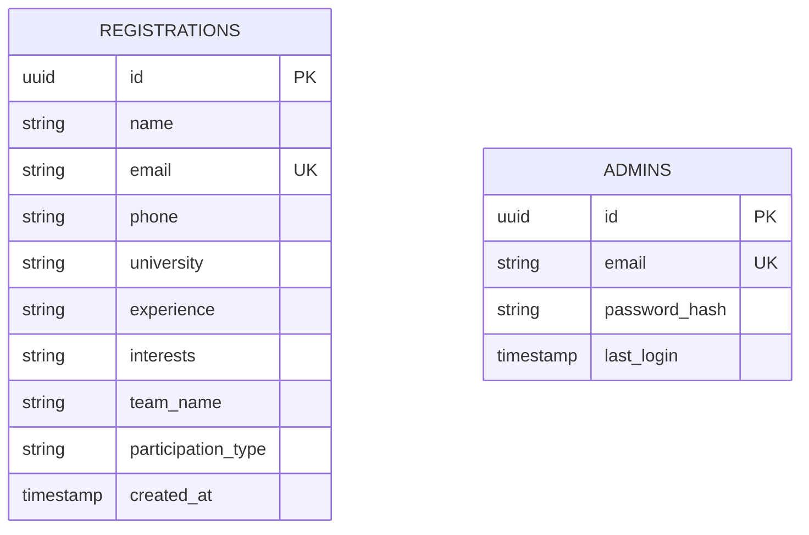
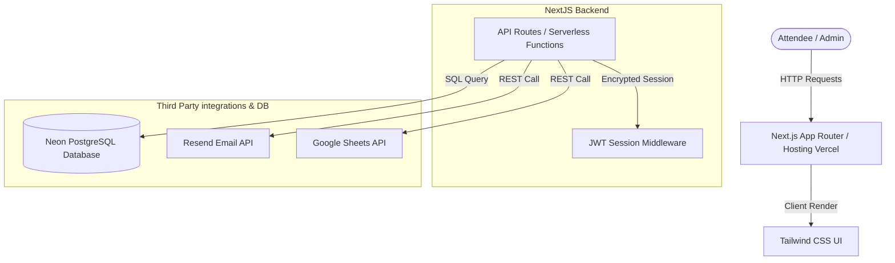

# 🎓 Final Year Project II — Practical & Viva Exam Preparation Guide
## Project: EventPro (Secure Event Management & Registration Platform)
### Developed for: NFC-IET Multan (Department of Computer Science)

This comprehensive guide is prepared to help you ace your FYP-II practical exam and viva. It provides detailed, project-specific answers aligned directly with your exam guidelines and grading criteria, fully framed for your NFC-IET presentation.

---

## 📋 Course Outline & Marking Scheme
* **20 Marks** – Project Performance Evaluation (Laptops & running implementation required)
* **30 Marks** – Practical / Viva Examination (Based on the areas detailed below)

---

## 1. Justification for Selecting Tools & Techniques

Your project uses a modern, industry-standard stack. Here is the technical justification for each choice:

| Tool/Technology | Role in Project | Engineering Justification (Why We Used It) |
| :--- | :--- | :--- |
| **Next.js 15 (React 18)** | Frontend & Backend (API Routes) | **Unified Architecture:** Handles both the UI and backend logic in a single codebase. Offers hybrid static-site generation (SSG) for instant page loads and serverless API routing for seamless scalability. |
| **TypeScript** | Language | **Type Safety:** Prevents runtime errors by catching bugs during build time, ensuring strict data contracts between form submissions and the database schema. |
| **Neon PostgreSQL** | Primary Database | **Serverless Scaling:** A fully-managed, highly-performant PostgreSQL database. Auto-scales database connections dynamically, making it ideal for high-traffic registration spikes. |
| **Tailwind CSS** | Styling | **Rapid Iterative Styling:** Utility-first utility classes allow custom styling, fully responsive grids, and clean layout animations without bulky custom stylesheet files. |
| **Resend API** | Communication | **High Deliverability:** Modern, developer-friendly email transactional service. Sends registration confirmations cleanly without getting flagged as spam. |
| **Google Sheets API** | Real-time Sync | **Business Usability:** Automatically syncs registration details to a Google Spreadsheet so non-technical event coordinators can view registrations live. |

---

## 2. Functional Requirements (What the system does)

Functional requirements define the core actions the system must perform:

1. **User Registration:** 
   - Multi-step registration form gathering user metadata (Name, Email, Phone, Organization, Programming Experience, Interests, and Team Name).
2. **Automated Confirmation:**
   - Real-time confirmation email dispatched to the user immediately upon successful registration database commit.
3. **Admin Dashboard:**
   - Secure admin authentication console allowing NFC-IET administrators to monitor registration metrics.
4. **Data Management & Export:**
   - Interactive admin panel showcasing active attendee counts, search/filter functionality, and one-click export of registration sheets into Excel/CSV spreadsheets.
5. **Real-time Synchronization:**
   - Instant push of new registrations to both the Neon PostgreSQL database and Google Sheets in a single atomic request workflow.

---

## 3. Non-Functional Requirements (How the system performs)

Non-functional requirements specify quality attributes of the system:

1. **Security (Critical):**
   - **Password Hashing:** Administrative passwords stored securely using `bcrypt` (12 rounds) with a Base64 signature.
   - **JWT Authentication:** Admin sessions managed via secure JSON Web Tokens stored in HTTP-Only, Secure, and SameSite cookies to mitigate XSS and CSRF risks.
   - **Input Sanitization:** Regex-based front-end validation and backend schema checks using `Zod`.
2. **Performance & Scalability:**
   - Serverless backend functions execute within milliseconds, optimizing load time and reducing latency globally.
   - Static asset optimization ensuring a Google Lighthouse performance score of 95+.
3. **Responsiveness:**
   - 100% mobile-friendly responsive layout designed with dynamic breakpoints for seamless navigation on smartphones, tablets, and desktops.
4. **Reliability:**
   - Transactional safety: If an email fails, the database registration remains secure, with error logs handled safely in the environment.

---

## 4. Entity-Relationship (ER) & Database Schema

The database model is designed for simplicity, speed, and high consistency.



* **Registrations Table:** Stores attendee-specific demographic and participation preferences. The `email` field is indexed and unique to prevent duplicate submissions.
* **Admins Table:** Stores encrypted administrative authentication records.

---

## 5. Swimlane Activity Diagram (System Operations)

This swimlane represents the user registration flow and integration check:

```mermaid
sequenceDiagram
    autonumber
    actor User as Attendee (Browser)
    participant Server as Next.js Serverless API
    database DB as Neon PostgreSQL
    participant Resend as Resend Email Service
    participant Sheets as Google Sheets API

    User->>Server: Submits Form Data (Name, Email, etc.)
    Note over Server: Validates input schemas via Zod
    Server->>DB: Check if Email already exists
    alt Email exists
        DB-->>Server: Duplicate found
        Server-->>User: Error: "Email already registered"
    else New Registration
        DB-->>Server: Email is unique
        Server->>DB: Insert registration details
        DB-->>Server: Success: Record created
        par Parallel Integrations
            Server->>Resend: Dispatch transactional confirmation email
            Server->>Sheets: Append registration row in real-time
        end
        Server-->>User: Success: Show Confirmation UI
    end
```

---

## 6. High-Level Block Diagram (System Architecture)



---

## 7. SDLC Choice & Justification

### Model Followed: **Agile Methodology (Iterative & Scrum-based Development)**

**Why We Chose It:**
* **Continuous Integration:** The system required progressive feature additions—starting from a simple landing page, followed by backend API integration, styling tweaks, email service setup, and admin dashboard creation.
* **Adaptability to Feedback:** When custom-fitting the platform for **NFC-IET**, the Agile framework allowed us to make fast design updates, database adjustments, and config updates without resetting previous development stages.
* **Risk Reduction:** Continuous manual testing at the end of each iteration ensured that security exploits (like input validation bypasses) were caught early before final deployment.

---

## 8. Test Case Design Methodology

We used a **hybrid testing approach** combining Black-Box testing for functional validations and White-Box testing for secure database and route handling.

### Key Test Cases

| Category | Test Scenario | Input Data | Expected Output | Status |
| :--- | :--- | :--- | :--- | :--- |
| **Boundary Value** | Validating empty fields in Registration | Blank fields | Registration rejected with "Please fill in all required fields." | Passed |
| **Format Validation** | Invalid email format entry | `invalid-email@com` | Form validation blocks submission instantly. | Passed |
| **Uniqueness** | Attempting duplicate registration | `john.doe@example.com` (already registered) | Registration fails; alert displays: "Email is already registered." | Passed |
| **Security** | Direct API access to Admin dashboard | HTTP GET to `/admin` without authentication cookie | Middleware intercepts request and redirects back to `/admin/login`. | Passed |
| **Integrations** | Concurrent database & sheet upload | Valid registration form payload | Database record created, email received, sheet successfully appended. | Passed |
