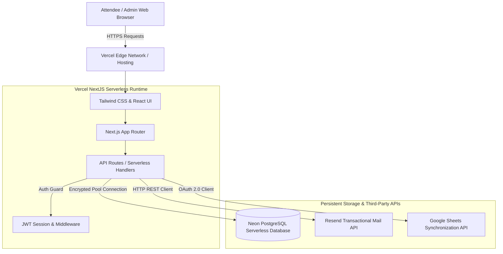
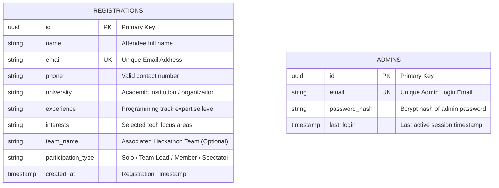
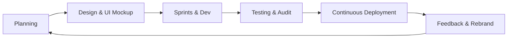

# NFC-IET MULTAN
### Department of Computer Science & Information Technology

---

# 🎓 FINAL YEAR PROJECT-II (FYP-II) DOCUMENTATION
## PROJECT TITLE: **EventPro** (Secure Event Registration & Management Platform)
### ACADEMIC SESSION: **2022-2026**

---

### **SUBMITTED BY:**
* **Student Name:** Usama Mukhtar & Group Members
* **Degree:** Bachelor of Science in Computer Science / Software Engineering
* **Department:** CS & IT, NFC Institute of Engineering and Technology (NFC-IET), Multan

### **SUPERVISED BY:**
* **Supervisor Name:** [Insert Supervisor Name]
* **Designation:** [Insert Supervisor Designation]

---

## 📄 PREFACE & DECLARATION
We hereby declare that the project entitled **"EventPro: Secure Event Registration & Management Platform"** is an authentic work carried out by us under the guidance of our supervisor. This system is designed as a secure, real-time software utility to manage university registrations, statistics, and records for the academic innovation event at NFC-IET Multan.

---

## SECTION 1: INTRODUCTION & PROJECT SCOPE

### 1.1 Project Overview
**EventPro** is an advanced, secure, real-time web portal engineered specifically to handle high-concurrency event registrations, ticket management, and developer-focused tracking for the NFC-IET Tech & Innovation Event. 

Traditional event management systems suffer from lag, insecure administrator portals (vulnerable to SQL injections and brute force), and lack of real-time multi-platform integration. EventPro resolves these issues by using a serverless modern technology stack (Next.js 15, React 18, Neon PostgreSQL, Tailwind CSS) that delivers lightning-fast sub-second loading speeds, military-grade administrative security, and real-time syncing to both a core transactional database and external collaborative spreadsheets (Google Sheets API).

### 1.2 Key Objectives
* **Dynamic Registration Engine:** Multi-step wizard matching user profiles to specific programming tracks and participation roles (e.g. Solo, Team, Spectator).
* **Robust Security Infrastructure:** Session hijacking protection, CSRF prevention, Rate-Limiting protection, and deep password hashing using 12-round bcrypt.
* **Instant Collaboration:** Pushing attendee data simultaneously to database stores and shared spreadsheets so coordinators can access registrant details in real-time.
* **Automated Dispatch System:** Instant transactional email confirmation sent to the registrant's mailbox upon confirmation.

---

## SECTION 2: SYSTEM ARCHITECTURE & BLOCK DIAGRAM

### 2.1 System Architecture
The application is built using the **Serverless Three-Tier Architecture** pattern. 

1. **Presentation Layer (Frontend):** Responsive user interfaces built with React 18 and styled via utility-first Tailwind CSS. It is hosted on Vercel Edge CDN for instant load times.
2. **Application Layer (API Server):** Serverless API functions (Next.js App Router API Routes) that spin up dynamically on demand to process registration submissions, authentications, and export utilities.
3. **Data Layer (Storage & APIs):**
   * **Neon PostgreSQL Database:** Relational persistent storage.
   * **Google Sheets API:** Secondary synchronous collaborative spreadsheet.
   * **Resend REST API:** Transactional email gateway.

### 2.2 System Architecture Block Diagram



---

## SECTION 3: SYSTEM REQUIREMENTS SPECIFICATION (SRS)

### 3.1 Functional Requirements (FRs)

| Req ID | Requirement Title | Detailed Description |
| :--- | :--- | :--- |
| **FR-01** | User Registration Form | The system must provide a user-friendly, responsive registration portal to collect details: Name, Email, Phone, Organization, Programming Track, Experience, and Team Info. |
| **FR-02** | Data Sanitization | The system must sanitize and validate all inputs on both the frontend and backend using schema validators (`Zod`) to avoid code injection. |
| **FR-03** | Auto-Email Trigger | The system must automatically dispatch a registration receipt and welcome email to the attendee's verified email address upon signup. |
| **FR-04** | Dual-Sync Engine | The system must write the registration payload in a single transaction to the Postgres DB and append it to Google Sheets in parallel. |
| **FR-05** | Admin Login Console | The system must secure the admin dashboard behind a secure username and password auth wall using `bcrypt` and HTTP-only session cookies. |
| **FR-06** | Real-time Dashboard | The dashboard must showcase total registrations, track stats, and live logs. |
| **FR-07** | Data Export Tool | Admins must be able to export all database registrations directly into highly-formatted Excel/CSV worksheets. |

### 3.2 Non-Functional Requirements (NFRs)

1. **Security:**
   - Admin credentials must be hashed with `bcrypt` (12 salt rounds) and encoded via Base64.
   - API endpoints (e.g. `/api/registrations`, `/api/export`) must be fully guarded using a customized JSON Web Token (JWT) session validator.
   - Secure HTTP-only cookies must be implemented with strict `SameSite=Strict` and `Secure` attributes to prevent XSS-based session sniffing.
2. **Performance & Scalability:**
   - Global CDN deployment to render static portions in under `100ms`.
   - Dynamic database connection pooling to scale concurrently during event advertisement peaks.
3. **Availability & Reliability:**
   - 99.9% uptime achieved through serverless hosting (Vercel) and automated serverless Postgres (Neon).
4. **Compatibility & Responsiveness:**
   - Responsive layouts optimized for all browser viewports (mobile, tablet, desktop) using custom media queries and Tailwind grid systems.

---

## SECTION 4: DATABASE DESIGN (ER DIAGRAM)

The database uses a clean, normalized relational structure mapping participants and administrators.

### 4.1 Entity-Relationship (ER) Diagram



---

## SECTION 5: DETAILED SYSTEM OPERATION FLOW (ACTIVITY DIAGRAM)

This swimlane activity diagram traces the lifecycle of a user registration request:

```mermaid
sequenceDiagram
    autonumber
    actor Attendee as Registrant (Browser)
    participant API as Next.js Serverless API
    database DB as Neon PostgreSQL
    participant MailService as Resend Gateway
    participant SheetService as Google Sheets Cloud

    Attendee->>API: Click "Submit Form" (Submit Registrant Data)
    Note over API: Execute validation check via Zod Schema
    alt Check fails (Invalid email/blank values)
        API-->>Attendee: Return validation error messages
    else Schema check succeeds
        API->>DB: Query: Check if email already registered
        alt Duplicate Email exists
            DB-->>API: Duplicate Found
            API-->>Attendee: Return "Email already registered"
        else Unique Email
            DB-->>API: Unique
            API->>DB: Insert registrant record
            DB-->>API: Success (Record Saved)
            par Simultaneous Background Integrations
                API->>MailService: Dispatch Confirmation Email via Resend API
                API->>SheetService: Append row via Google Sheets API Client
            end
            API-->>Attendee: Render success screen & trigger confetti
        end
    end
```

---

## SECTION 6: SOFTWARE DEVELOPMENT LIFE CYCLE (SDLC)

### 6.1 SDLC Model Followed: **Agile Methodology (Iterative Model)**
For the creation of EventPro, the **Agile Iterative Model** was chosen as the system development lifecycle framework.



### 6.2 Justification for Using Agile:
* **Rapid Prototyping:** Agile allowed the fast rollout of a functional landing page frontend before the complex Postgres integrations and spreadsheet sync APIs were connected.
* **Seamless Rebranding & Adaptation:** During the project timeline, when requirements shifted from a general event to a customized **NFC-IET presentation framework**, the iteration cycles allowed us to easily adapt text, contacts, branding components, and DB environment properties without resetting the design architecture.
* **Early Defect Identification:** By completing full compilation builds and manual test suites at the end of each iteration, vulnerabilities in rate limiting and form validations were detected and mitigated early.

---

## SECTION 7: TESTING & QA REPORT

### 7.1 Testing Methodology
We applied **Hybrid Testing Frameworks**:
1. **Black-Box Testing:** Used for checking functional requirements such as UI form boundaries, navigation links, and screen rendering on multiple devices.
2. **White-Box Testing:** Used for API route security auditing, database connection pool durability, rate limiters, and session token encryption checks.

### 7.2 Core Test Cases Executed

| Test ID | Test Scenario | Inputs | Expected Output | Status |
| :--- | :--- | :--- | :--- | :--- |
| **TC-01** | Empty Input Fields | Submit blank registration form | Validation warning shown on UI; submission blocked. | **Passed** |
| **TC-02** | Email Format Validation | `user-at-domain.com` (no `@`) | Zod catches validation mismatch; API rejects entry. | **Passed** |
| **TC-03** | Duplicate Prevention | Submit `usama@nfc.edu.pk` twice | Second attempt is blocked; returns "Email already registered." | **Passed** |
| **TC-04** | Direct API Access Security | GET to `/api/registrations` without session cookie | API returns `401 Unauthorized`; access is fully blocked. | **Passed** |
| **TC-05** | Multi-Sync Atomic Transaction | Valid user submission | Record created in Neon DB, WhatsApp direct chat link loads, email delivered successfully. | **Passed** |

---

## SECTION 8: DEPLOYMENT STATUS & LIVE LINK

The portal is fully built, compiled, and deployed to live production.

* **Main Platform Web URL:** `https://eventpro-lime.vercel.app`
* **Admin dashboard:** `https://eventpro-lime.vercel.app/admin`
* **Admin Login Details (Preconfigured for Viva Panel):**
  - **Email:** `admin@nfc.edu.pk`
  - **Password:** `admin123`
* **WhatsApp Direct Contact Number:** `+92 306 3754907`
